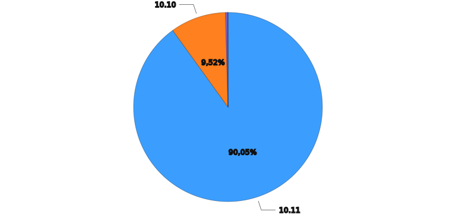
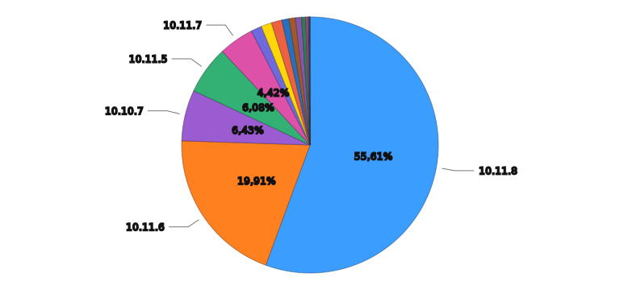
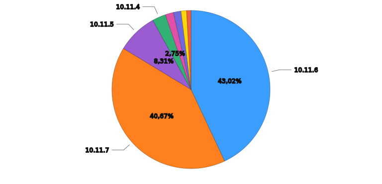
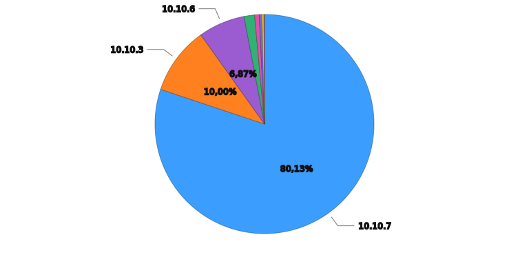

# Axiom Query Results

| Metric | Value |
| ------ | ----- |
| Query Time Range | 2026-02-06T02:06:00Z to 2026-02-07T02:06:00Z |
| Rows Matched | 117,166 |
| Elapsed Time | 312653ms |

## Requests by Jellyfin Server Version

## Requests by Patch Version (10.10, 10.11, 10.12)

## Version 10.11

## Version 10.10

## Summary by Agent

| Agent | Total Count |
| ----- | ----------- |
| Jellyfin-Server/10.12.0 | 254 |
| Jellyfin-Server/10.11.6 | 67,396 |
| Jellyfin-Server/10.11.5 | 22,130 |
| Jellyfin-Server/10.11.4 | 3,933 |
| Jellyfin-Server/10.11.3 | 3,462 |
| Jellyfin-Server/10.11.2 | 2,509 |
| Jellyfin-Server/10.11.1 | 1,122 |
| Jellyfin-Server/10.11.0 | 1,663 |
| Jellyfin-Server/10.10.7 | 11,799 |
| Jellyfin-Server/10.10.6 | 1,002 |
| Jellyfin-Server/10.10.5 | 225 |
| Jellyfin-Server/10.10.4 | 42 |
| Jellyfin-Server/10.10.3 | 1,181 |
| Jellyfin-Server/10.10.2 | 74 |
| Jellyfin-Server/10.10.1 | 108 |
| Jellyfin-Server/10.10.0 | 65 |
| Jellyfin-Server/10.9.11 | 80 |
| Jellyfin-Server/10.9.10 | 13 |
| Jellyfin-Server/10.9.9 | 13 |
| Jellyfin-Server/10.9.8 | 3 |
| Jellyfin-Server/10.9.7 | 10 |
| Jellyfin-Server/10.9.6 | 8 |
| Jellyfin-Server/10.9.4 | 2 |
| Jellyfin-Server/10.9.3 | 7 |
| Jellyfin-Server/10.9.2 | 1 |
| Jellyfin-Server/10.9.0 | 1 |
| Jellyfin-Server/10.8.13 | 31 |
| Jellyfin-Server/10.8.12 | 3 |
| Jellyfin-Server/10.8.10 | 17 |
| Jellyfin-Server/10.8.9 | 3 |
| Jellyfin-Server/10.8.8 | 2 |
| Jellyfin-Server/10.7.7 | 2 |

---
*Generated at 2026-02-07T02:06:01.313Z*
