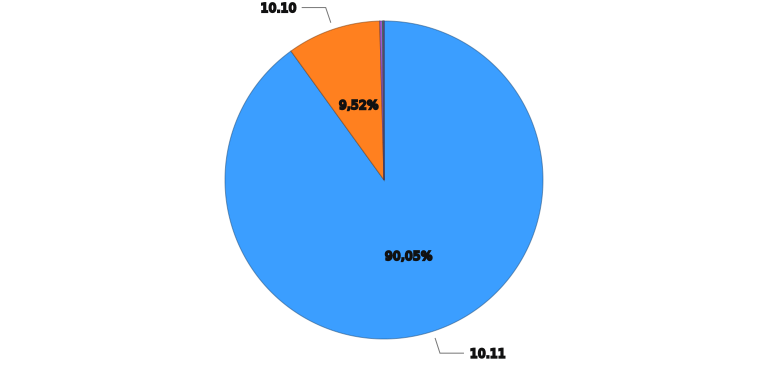
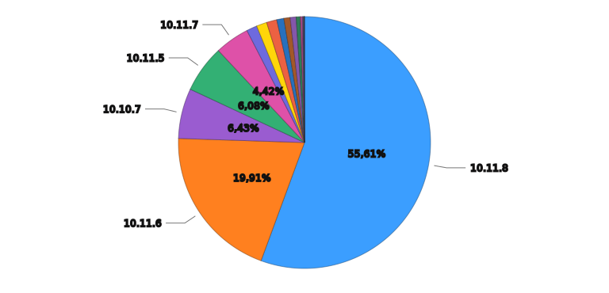
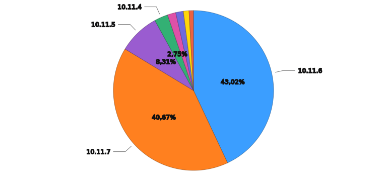
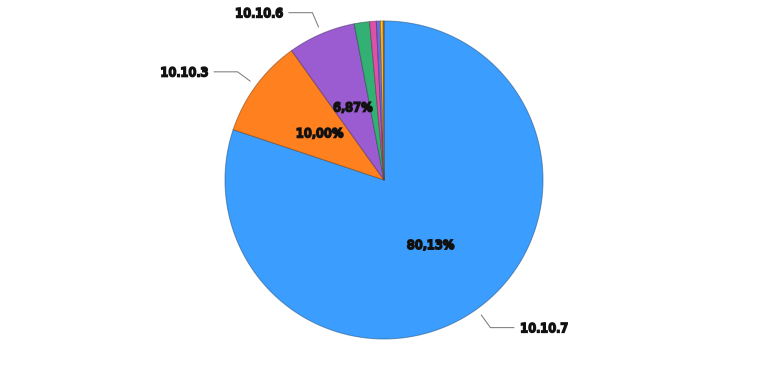

# Axiom Query Results

| Metric | Value |
| ------ | ----- |
| Query Time Range | 2026-03-22T02:26:30Z to 2026-03-23T02:26:30Z |
| Rows Matched | 128,512 |
| Elapsed Time | 262877ms |

## Requests by Jellyfin Server Version

## Requests by Patch Version (10.10, 10.11, 10.12)

## Version 10.11

## Version 10.10

## Summary by Agent

| Agent | Total Count |
| ----- | ----------- |
| Jellyfin-Server/10.12.0 | 314 |
| Jellyfin-Server/10.11.6 | 94,167 |
| Jellyfin-Server/10.11.5 | 12,082 |
| Jellyfin-Server/10.11.4 | 2,695 |
| Jellyfin-Server/10.11.3 | 2,393 |
| Jellyfin-Server/10.11.2 | 1,828 |
| Jellyfin-Server/10.11.1 | 823 |
| Jellyfin-Server/10.11.0 | 1,297 |
| Jellyfin-Server/10.10.7 | 10,095 |
| Jellyfin-Server/10.10.6 | 933 |
| Jellyfin-Server/10.10.5 | 232 |
| Jellyfin-Server/10.10.4 | 31 |
| Jellyfin-Server/10.10.3 | 1,248 |
| Jellyfin-Server/10.10.2 | 12 |
| Jellyfin-Server/10.10.1 | 87 |
| Jellyfin-Server/10.10.0 | 61 |
| Jellyfin-Server/10.9.11 | 85 |
| Jellyfin-Server/10.9.10 | 10 |
| Jellyfin-Server/10.9.9 | 15 |
| Jellyfin-Server/10.9.8 | 4 |
| Jellyfin-Server/10.9.7 | 25 |
| Jellyfin-Server/10.9.6 | 10 |
| Jellyfin-Server/10.9.4 | 3 |
| Jellyfin-Server/10.9.3 | 4 |
| Jellyfin-Server/10.9.2 | 2 |
| Jellyfin-Server/10.8.13 | 24 |
| Jellyfin-Server/10.8.12 | 3 |
| Jellyfin-Server/10.8.11 | 2 |
| Jellyfin-Server/10.8.10 | 14 |
| Jellyfin-Server/10.8.9 | 2 |
| Jellyfin-Server/10.8.8 | 2 |
| Jellyfin-Server/10.8.4 | 2 |
| Jellyfin-Server/10.8.0 | 1 |
| Jellyfin-Server/10.7.7 | 1 |

---
*Generated at 2026-03-23T02:26:30.473Z*
